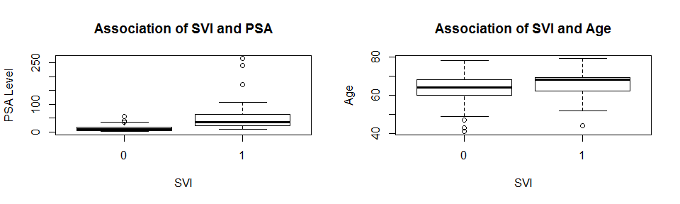

Modeling a Prognostic Indicator of Prostate Cancer
================
Anne (Annie) Lott

November 9, 2018


Introduction
============

According research conducted by the American Cancer Society, in 2018 around 165,000 men in the United States will be diagnosed with prostate cancer, the most common cancer in men after skin cancer (*Key Statistics*, 2018). If a patient is diagnosed with prostate cancer, the next step is to determine the prognosis, the likely result of the cancer in the near future. Arriving at an accurate prognosis helps the doctor create a treatment strategy, while also aiding the patient and his family with life planning given the disease.

Question and Motivation
=======================

Given how common prostate cancer is, a relevant question is whether or not data collected from minimally invasive to non-invasive procedures, such as a blood test, can be used to model prostate cancer severity measures, while also aiding in the prediction of those severity measures. It would be beneficial to the patient if the doctor could determine a prognosis using minimally-invasive or non-invasive procedures, to reduce physical pain and expense. My goal in this paper is to arrive at a model physicians can use to make prostate cancer prognoses, that is only based on data collected from non-invasive to minimally invasive procedures.

Description of the Data Set
===========================

Stamey et al. (1989) collected data on 97 men with prostate cancer who were about to undergo radical prostatectomies. This data was provided in a modified form in Kutner et al. (2004). The variables measured for each patient included his identification number, his pre-operative prostate specific antigen (PSA) level in mg/ml, obtained through a blood test, the prostate cancer volume in cc, the weight of the prostate in gm, the age of the individual, the amount of benign prostatic hyperplasia, or prostate enlargement, in cm^2, whether or not there was seminal vesicle invasion (recorded as 1 if yes, 0 otherwise), the amount of capsular penetration in cm, and the Gleason score, a grade of the disease where a higher score indicates a worse prognosis.

Relevance of the Data Set
=========================

This data set can be used to answer the question of whether data from minimally invasive to non-invasive procedures could be used to build a model of prostate cancer severity, because two variables, the PSA level and the age of the patient, were collected in such a manner. I used these variables to model seminal vesicle invasion, which Potter et al. (2000) demonstrates is an indicator of a poor prognosis if indeed seminal vesicle invasion has occurred. The prognosis would be poor in the case of seminal vesicle invasion, because the cancer would have spread outside the prostate and invaded the seminal vesicle, a different gland.

Modeling the Gleason score may have been a more obvious choice for answering the research question. The reason I did not choose to model the Gleason score was that preliminary results showed that models using the PSA level and age could not predict the Gleason score with a high level of accuracy.

Exploratory Data Analysis
=========================

To further explore the data, I created box-plots of the seminal vesicle invasion (SVI) variable versus PSA level and age.

``` r
#read in data
prostate_cancer = read.table("APPENC05.txt", header = FALSE)
#set column names
colnames(prostate_cancer) = c("id", "psa", "volume", "weight", 
                              "age", "hyperplasia", "svi", 
                              "capsular_pen", "gleason")
par(mfrow = c(1,2))
#plot of psa versus svi
plot(as.factor(prostate_cancer$svi), prostate_cancer$psa,
     xlab = "SVI", ylab = "PSA Level", main = "Association of SVI and PSA")
#plot of age versus svi
plot(as.factor(prostate_cancer$svi), prostate_cancer$age,
     xlab = "SVI", ylab = "Age", main = "Association of SVI and Age")
```

 It's easy to notice that seminal vesicle invasion is generally associated with higher PSA levels from the first box-plot. In the second box-plot, one may observe that there is a slight association of seminal vesicle invasion with age, but more rigorous tests must be performed to ascertain whether the difference in ages of patients with or without seminal vesicle invasion is significant.

Model Development
=================

To model seminal vesicle invasion based on age of the patient and PSA level, I chose to use logistic regression, a classification method. Logistic regression models the probability of a binary random variable, such as the presence or absence of seminal vesicle invasion, given values of the predictors. Logistic regression modelling requires that the observations are independent and that the predictor variables are not linearly related (*Assumptions*, 2018). I assume that the observations are independent because they come from different men, and I checked the correlation between age and PSA level to ensure that they were not linearly associated.

``` r
#correlation between age and psa level
age_psa_r = cor(prostate_cancer$age, prostate_cancer$psa)
```

The correlation coefficient between age and PSA level was 0.017, so there is no multicollinearity between these independent variables.

Logistic regression also requires that the sample size is large (*Assumptions*, 2018). I will train my logistic regression model on 67 observations, which I believe is a sufficiently large sample size. Finally, logistic regression necessitates that the log-odds of the response variable is linearly associated with the predictor variables (*Assumptions*, 2018). I will check this assumption after I build my model, to see if the model is correct.

My preliminary logistic regression model will contain two predictors, PSA level and age.

Model Fitting
=============

Since the box-plot of age versus seminal vesicle invasion didn't show much difference in ages for men with seminal vesicle invasion and for men without seminal vesicle invasion, I tested the full model just described, and a reduced model, including just PSA level as a predictor, and not age. I hypothesized that the reduced model would work just as well as the full model because I thought, based on the box-plot, that age probably was not a significant predictor of seminal vesicle invasion.

I randomly divided the data into a training set including 67 observations and a test set of 30 observations, fit the full and reduced models on the training set and found the prediction errors on the test set, and repeated this procedure two more times. To be concise, I only display the code to fit the model and find the prediction accuracy for one training and test set, since the code is similar for all replications of this procedure. I set the probability threshold for predicting a "yes" for seminal vesicle invasion at 0.4 to reduce the false negative rate, because it's most important that patients who have seminal vesicle invasion to know that it indeed has occurred.

``` r
#set seed for consistency and reproducibility
set.seed(1)

#produce random sample of observations
training_samp = sample(dim(prostate_cancer)[1],67)

#create training data set from the previous random sample
training_set = prostate_cancer[training_samp,]

#create test set, taking out the training set from the data
test_set = prostate_cancer[-training_samp,]

#label the true svi in the test set
true_svi = test_set$svi

#first run logistic regression of svi on psa and age
glm.svi = glm(svi~ psa + age, data = prostate_cancer, family = binomial, 
              subset = training_samp)

#find the p-values associated with psa and age
summary1 = summary(glm.svi)

#make predictions for your test set with the logistic regression
glm.probs = predict(glm.svi, test_set, type = "response")

#predict presence of svi for probabilities greater than 
#0.4, and absence of svi for probabilities less than 0.4
glm.pred = rep(0, dim(test_set)[1])
glm.pred[glm.probs > 0.4] = 1

#look at the table of correct and incorrect predictions
table1 = table(glm.pred, true_svi)

#find the prediction accuracy rate
run1 = mean(glm.pred == true_svi)

#now run logistic regression of svi on just psa
glm.svi2 = glm(svi~ psa, data = prostate_cancer, family = binomial, 
              subset = training_samp)

#make predictions for your test set with the logistic regression
glm.probs2 = predict(glm.svi2, test_set, type = "response")

#find the p-value of psa
summary2 = summary(glm.svi2)

#predict presence of svi for probabilities greater than 
#0.4, and absence of svi for probabilities less than 0.4
glm.pred2 = rep(0, dim(test_set)[1])
glm.pred2[glm.probs2 > 0.4] = 1

#look at the table of correct and incorrect predictions
table2 = table(glm.pred2, true_svi)

#find the prediction accuracy
run2 = mean(glm.pred2 == true_svi)
```

Model Analysis
==============

I first need to check the assumption that the predictors are linearly related to the log-odds. I do so now. 

While PSA seems to be linearly related to the log-odds of seminal vesicle invasion, age does not seem to have a good linear association with the log-odds because of several outliers. Therefore not all of the assumptions are met for this training set, and my model may not be accurate when including age as a predictor. Checks of the linear association of the predictors with the log-odds of seminal vesicle invasion produced similar results when using the two different training sets selected by random sampling

When fitting my full model to the first training set, the algorithm produced a coefficient of 0.086 for PSA level, with a p-value of 0.00226. For age, the coefficient was 0.109, with a p-value of 0.11384. These coefficients can be interpreted in the following manner: for a man of a given age, an increase in PSA level of 1 mg/ml would increase the log-odds of seminal vesicle invasion by an estimated 8.6%, while for a man with a given PSA level, aging one year would increase the log-odds of seminal vesicle invasion by an estimated 10.9%. The coefficient for *β*<sub>0</sub> has no good interpretation in this context, because neither the PSA level or the age of the patient can be zero. Despite the large aparent increase in log-odds of seminal vesicle invasion for an increase in age, the coefficient for age is not significant, as its p-value is above alpa = 0.05. The p-value for PSA is significant, on the other hand.

When fitting the reduced model, including just the PSA level as a predictor, the coefficient of PSA level went up to 0.090, a small difference, and the p-value remained stable at 0.00281. This model indicates that an increase in PSA level by 1 mg/ml would increase the log-odds of seminal vesicle invasion by an estimate 8.6%.

I used the full and reduced models fit on the first training set to predict seminal vesicle invasion on the test set. The confusion matrices are given below.

``` r
#full model
table1
```

    ##         true_svi
    ## glm.pred  0  1
    ##        0 21  3
    ##        1  1  5

``` r
#reduced model
table2
```

    ##          true_svi
    ## glm.pred2  0  1
    ##         0 19  4
    ##         1  3  4

Examining these confusion matrices, I observe that both models generally give accurate predictions when the patient actually does not have seminal vesicle invasion. However, the accuracy goes down to 50% for the reduced model when the patient does have seminal vesicle invasion, while for the full model, the accuracy is only 62.5% when the patient does have seminal vesicle invasion. Overall, the predicition accuracy was 86.67% for the full model and 76.67% for the reduced model.

Creating a different training and test set at random two more times, fitting the full and reduced models to the training sets, and validating them on the test sets, I obtained similar results. The p-value for the coefficient for PSA level was always below 0.01 while the p-value for the age coefficient was always above 0.05.

For the second randomly sampled test set, I found that for men with seminal vesicle invasion, only 50% are classified correctly by the model. For the third randomly sampled test set, men with seminal vesicle invasion are classified correctly in 66.67% of the cases. The overall accuracy rate of the full and the reduced model was 90% for the second test set and 76.67% for the third test set. Since the full and reduced models have the same accuracy, I conclude that age has no predictive power here.

Conclusions
===========

Based on my logistic regression modelling, I can conclude that elevated PSA levels are associated with a higher log-odds of seminal vesicle invasion. Age may or may not be a significant predictor of seminal vesicle invasion, because the assumption of linearity of this predictor with the log-odds of seminal vesicle invasion was not met. Though the logistic regression model achieved prediction accuracies between 76.67% and 90%, it did not classify men with seminal vesicle invasion correctly at high rates. Though this model shows promise, it can not at this point be used to reliably model the severity of prostate cancer through predicting seminal vesicle invasion.

To increase the prediction accuracy of the logistic regression model, I would need to collect more data on the variables included in the Stamey et al. 1989 study. Only 21 men had seminal vesicle invasion in the study, which may have been too few to properly fit a model on. To answer my original question, minimally invasive procedures can be used to model prostate cancer severity, through PSA levels, but although this predictor is significant in the model, the predictive power of the model is not high in some cases. With more data, perhaps we will be able to build a model to allow a physician to make an accurate prognosis of prostate cancer, without a biopsy, in the future.

References
==========

*Assumptions of logistic regression*. Retrieved from <https://www.statisticssolutions.com/assumptions-of-logistic-regression/>

James, G., Witten, D., Hastie, T., and Tibshirani, R. (2013). *An introduction to statistical learning with applications in R*. New York, NY: Springer.

*Key statistics for prostate cancer*. (2018). Retrieved from <https://www.cancer.org/cancer/prostate-cancer/about/key-statistics.html>

Kutner M.H., Nachtsheim, C.J., and Neter, J. (2004). *Applied linear regression models* (4th ed.). Boston, MA: McGraw-Hill Irwin.

Potter, S.R., Epstein, J.I., and Partin, A.W. (2000). "Seminal vesicle invasion by prostate cancer: Prognostic significance and therapeutic implications." *Reviews in Urology, 2(3),* 190-195.

Stamey, T.A., Kabalin, J.N., McNeal, J.E., Johnstone, I.M., Freiha, F., Redwine, E.A., and Yang, N. (1989). "Prostate specific antigen in the diagnosis and treatment of adenocarcinoma of the prostate. II. Radical prostatectomy treated patients." *The Journal of Urology, 141,* 1076-1083.
